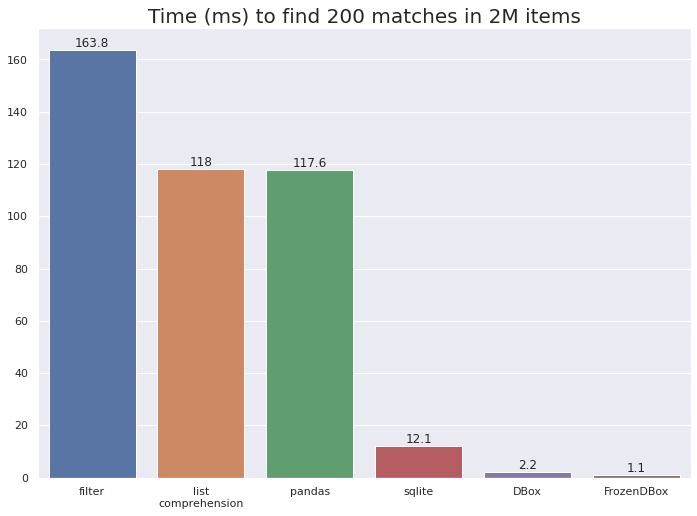

[](https://github.com/manimino/filterbox/actions)
[](test/cov.txt)
[](/LICENSE)


# FilterBox

Container that stores objects in database-like indexes for fast lookup.

#### Install: 

```
pip install filterbox
```

#### Usage:
```
from filterbox import FilterBox

objects = [{'x': 4, 'y': 1}, {'x': 6, 'y': 2}, {'x': 8, 'y': 5}]

# create a FilterBox containing objects, indexed on x and y
fb = FilterBox(objects, ['x', 'y'])  

# find the ones you want
fb[{
    'x': {'>': 5, '<': 10},     # find objects where x is between 5 and 10
    'y': {'in': [1, 2, 3]}      # and y is 1, 2, or 3
}]
# result: [{'x': 6, 'y': 2}]
```

Valid operators are ==, !=, <, <=, >, >=, in, not in. 

#### Is FilterBox a database?

No. But like a database, FilterBox builds B-tree indexes and uses them to find results very quickly. It does
not any do other database things like SQL, tables, etc. This keeps FilterBox simple, light, and performant.

#### Is FilterBox fast?

Yes. Here's how FilterBox compares to other object-finders on an example task.



[Benchmark code](examples/perf_demo.ipynb)

The closest thing to a FilterBox is an in-memory SQLite. While SQLite is a fantastic database, it requires
more overhead. As such, FilterBox is generally faster.

### Class APIs

There are three containers.
 - [FilterBox](https://filterbox.readthedocs.io/en/latest/filterbox.mutable.html#filterbox.mutable.main.FilterBox): 
Can `add`, `remove`, and `update` objects after creation.
 - [ConcurrentFilterBox](https://filterbox.readthedocs.io/en/latest/filterbox.concurrent.html#filterbox.concurrent.main.ConcurrentFilterBox): 
Same as FilterBox, but thread-safe.
 - [FrozenFilterBox](https://filterbox.readthedocs.io/en/latest/filterbox.frozen.html#filterbox.frozen.main.FrozenFilterBox):
Cannot be changed after creation, it's read-only. But it's super fast, and of course thread-safe.

All three can be pickled using the special functions `filterbox.save()` / `filterbox.load()`. 

### Part 2

[Readme Part 2](/README_part_2.md) has lots more examples, including handling of nested data and missing attributes.
