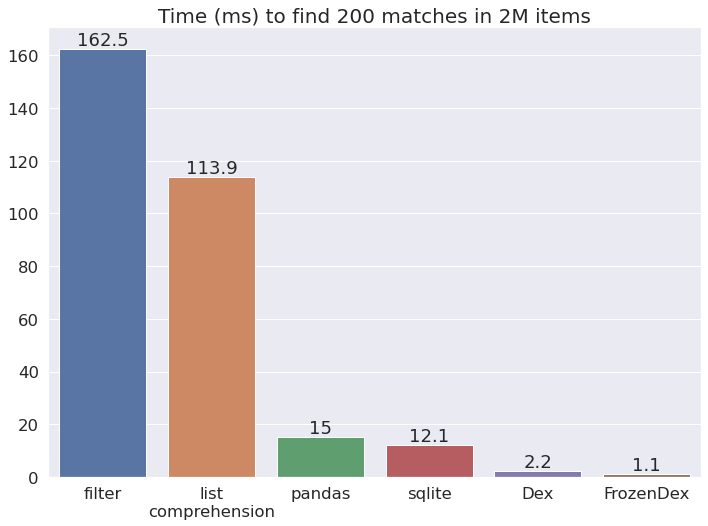

.. ducks documentation master file, created by
   sphinx-quickstart on Fri Aug  5 07:18:13 2022.

ducks
=====

Is Dex a database?
==================

No. But like a database, Dex uses B-tree indexes and uses them to find results very quickly. It does
not any do other database things like SQL, tables, etc. This keeps Dex simple, light, and performant.

Is Dex fast?
============

Yes. Here's how Dex compares to other object-finders on an example task.

`Benchmark code <https://github.com/manimino/ducks/blob/main/examples/perf_demo.ipynb>`_

The closest thing to a Dex is an in-memory SQLite. While SQLite is a fantastic database, it requires
more overhead. As such, Dex is generally faster.

Contents
========

.. toctree::

   Home <self>
   quick_start
   how_it_works
   ducks
   demos

* :ref:`modindex`
* :ref:`search`

The examples `in the README`_ are the best way to get started.

.. _in the README: https://pypi.org/project/ducks/
